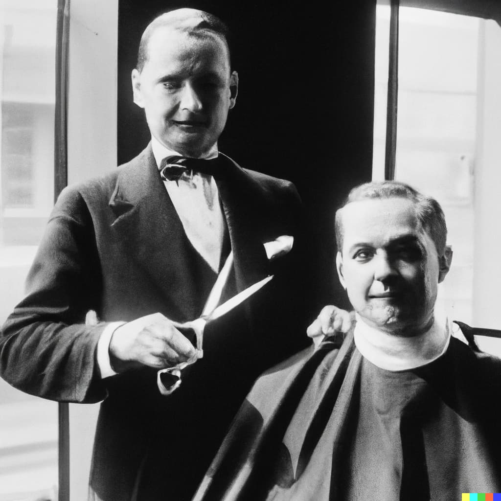

Git-tisburg, UK - A wave of fear has swept through the town of Git-tisburg, as yet another murder has occurred within its borders. The latest incident took place on the night of August 6th, 1977, leaving residents shaken and police scrambling to investigate.

The victim, identified as William Brown, was a local shopkeeper who had been well-respected in the community for keeping such good track of the different versions of his inventory. His body was found in his store, which had been ransacked and robbed. It appeared that the perpetrator had broken in through the back door and attacked Brown, leaving him with fatal injuries.

The police have launched an extensive investigation into the crime and have urged anyone with information to come forward. Evidence at the scene suggests that the perpetrator was the *same one as in the two previous murders*.

Authorities have assured the public that they are doing everything in their power to bring the perpetrator to justice and have increased patrols in the area. They have also stated that they are investigating all possible leads and currently in talks with the three people found at the scene: Mr. Benjamin Edwards, who used to be working as a *butler* at the Smith mansion; Mrs. Amelia Rosewood who has been working as the *carpenter* in town for many years and Mr. Charles Fletcher, who *can be seen alongside his craft* in the picture above.

As the investigation continues, the town of Git-tisburg is left mourning the loss of another of its citizens and hoping for an end to the violence that has plagued the community in recent years.